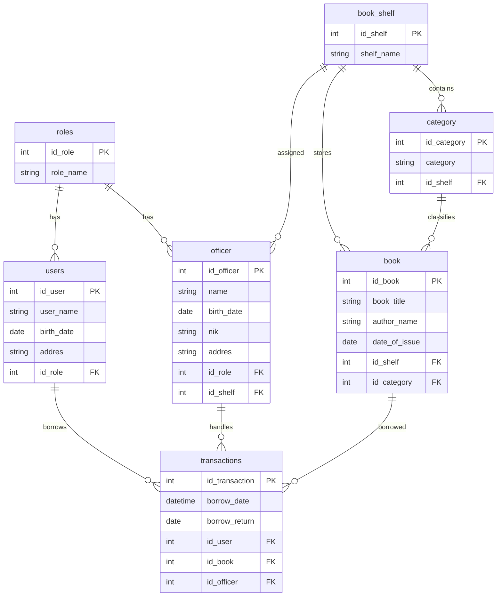

```mermaid
erDiagram

    roles {
        int id_role PK
        string role_name
    }

    users {
        int id_user PK
        string user_name
        date birth_date
        string addres
        int id_role FK
    }

    book_shelf {
        int id_shelf PK
        string shelf_name
    }

    officer {
        int id_officer PK
        string name
        date birth_date
        string nik
        string addres
        int id_role FK
        int id_shelf FK
    }

    category {
        int id_category PK
        string category
        int id_shelf FK
    }

    book {
        int id_book PK
        string book_title
        string author_name
        date date_of_issue
        int id_shelf FK
        int id_category FK
    }

    transactions {
        int id_transaction PK
        datetime borrow_date
        date borrow_return
        int id_user FK
        int id_book FK
        int id_officer FK
    }

    roles ||--o{ users : has

    roles ||--o{ officer : has

    book_shelf ||--o{ officer : assigned

    book_shelf ||--o{ category : contains

    book_shelf ||--o{ book : stores

    category ||--o{ book : classifies

    users ||--o{ transactions : borrows

    officer ||--o{ transactions : handles

    book ||--o{ transactions : borrowed
```