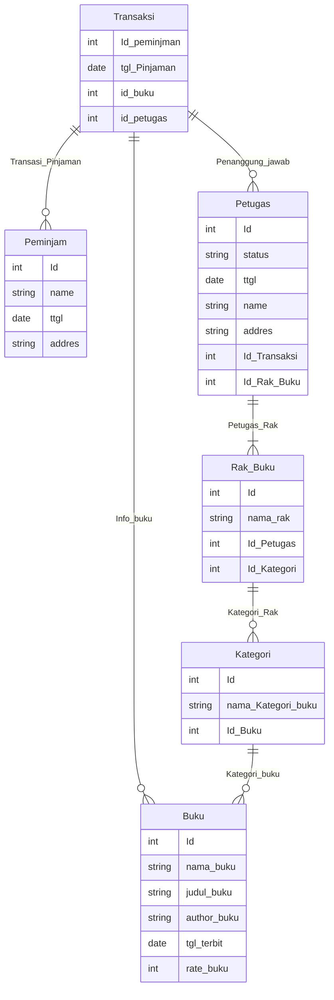

```mermaid 
erDiagram
    Peminjam{
        int Id
        string name
        date ttgl
        string addres
    }

    Transaksi{
        int Id_peminjman
        date tgl_Pinjaman
        int id_buku
        int id_petugas
    }

    Petugas{
        int Id
        string status
        date ttgl
        string name
        string addres
        int Id_Transaksi
        int Id_Rak_Buku
    }

    Rak_Buku{
        int Id
        string nama_rak
        int Id_Petugas
        int Id_Kategori
    }

    Kategori{
        int Id
        string nama_Kategori_buku
        int Id_Buku
    }

    Buku{
        int Id
        string nama_buku
        string judul_buku
        string author_buku
        date tgl_terbit
        int rate_buku
    }

    Transaksi ||--o{ Peminjam : Transasi_Pinjaman

    Transaksi ||--o{ Buku : Info_buku

    Transaksi ||--o{ Petugas : Penanggung_jawab

    Kategori ||--o{ Buku : Kategori_buku

    Rak_Buku ||--o{ Kategori : Kategori_Rak

    Petugas ||--|{ Rak_Buku : Petugas_Rak

```