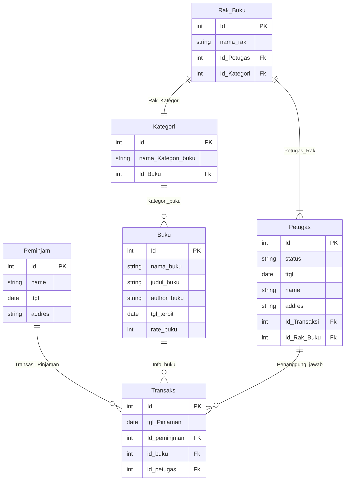

```mermaid 
erDiagram
    Peminjam{
        int Id PK
        string name
        date ttgl
        string addres
    }

    Transaksi{
        int Id PK
        date tgl_Pinjaman 
        int Id_peminjman FK
        int id_buku Fk
        int id_petugas Fk
    }

    Petugas{
        int Id PK
        string status
        date ttgl
        string name
        string addres
        int Id_Transaksi Fk
        int Id_Rak_Buku Fk
    }

    Rak_Buku{
        int Id PK
        string nama_rak
        int Id_Petugas Fk
        int Id_Kategori Fk
    }

    Kategori{
        int Id PK
        string nama_Kategori_buku
        int Id_Buku Fk
    }

    Buku{
        int Id PK
        string nama_buku
        string judul_buku
        string author_buku
        date tgl_terbit
        int rate_buku
    }

    Peminjam ||--o{ Transaksi : Transasi_Pinjaman

    Buku ||--o{ Transaksi : Info_buku

    Petugas ||--o{ Transaksi : Penanggung_jawab

    Kategori ||--o{ Buku : Kategori_buku

    Rak_Buku ||--|| Kategori : Rak_Kategori

    Rak_Buku ||--|{ Petugas : Petugas_Rak

```